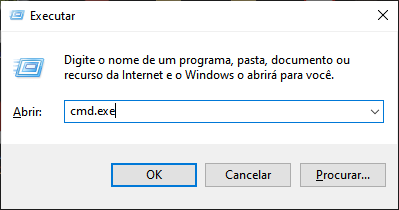
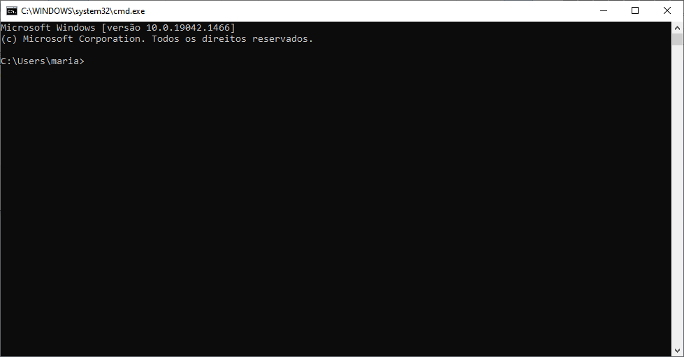
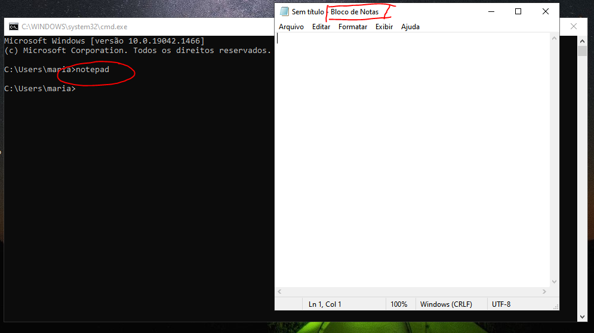
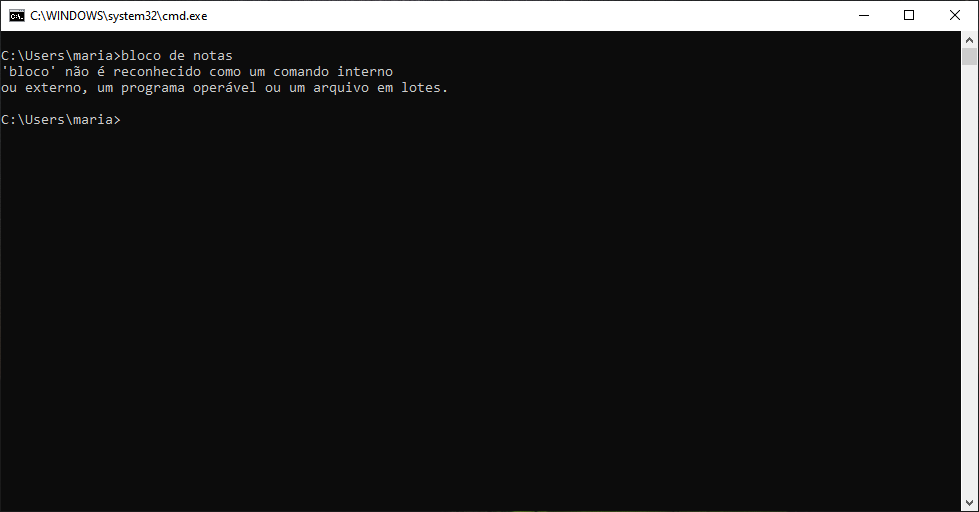
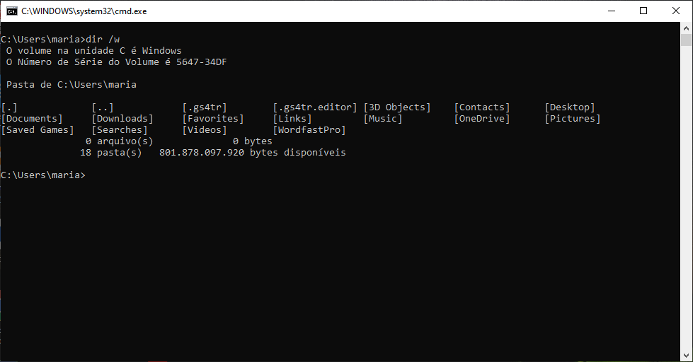
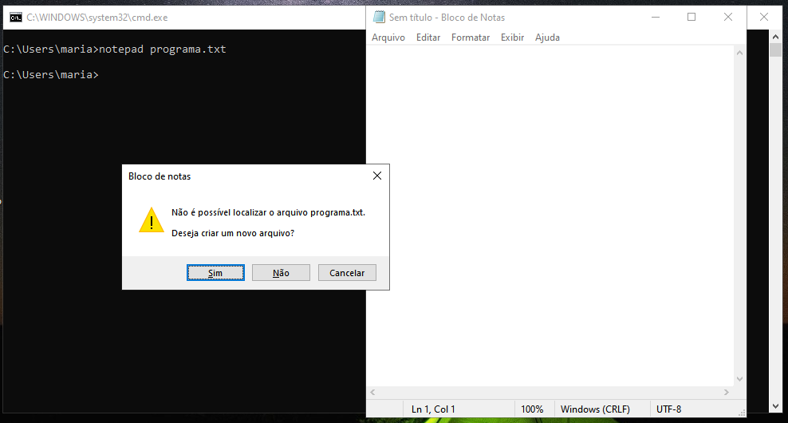
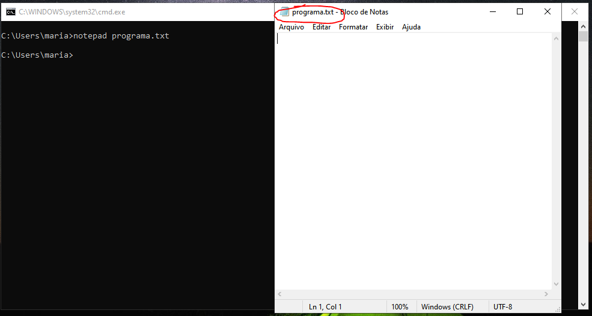
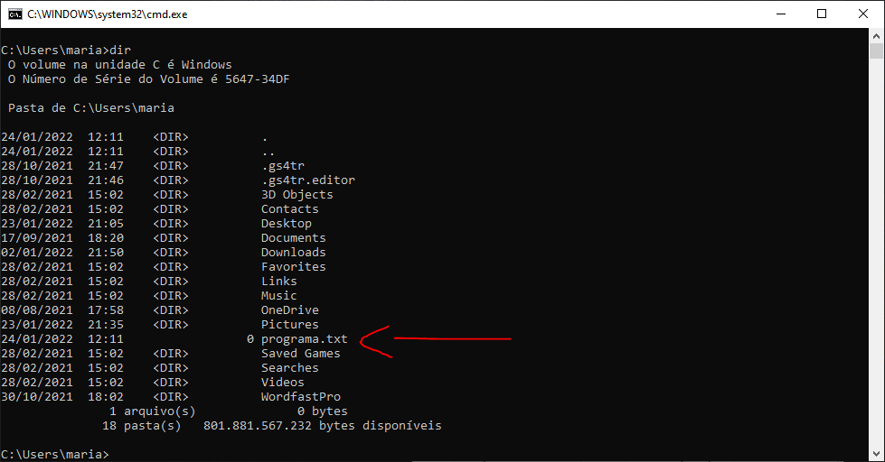

# Como usar a linha de comando - Windows

Precisamos da linha de comando para realizar várias tarefas cotidianas de programação. Aqui vamos experimentar três:

1. listar os arquivos de um diretório
1. rodar um programa em linha de comando
1. criar um arquivo de texto usando o notepad

Apesar de ser possível realizar todas elas usando uma interface gráfica, a linha de comando acaba sendo mais cômoda e eficiente para essas e outras tarefas à medida que você se acostuma a programar e a trabalhar com código, porque para usá-la também usamos código. Assim, fica tudo em casa. 

Além disso, aprender a usar a linha de comando já é começar a aprender programação, porque já estamos trabalhando com código.

## O que é a linha de comando

A linha de comando é uma interface com o computador, como as interfaces gráficas, porém em modo texto. Isso significa que você precisa escrever tudo o que quiser que o computador faça e que toda resposta que o computador tiver será comunicada a você também na forma de texto.

Esse texto que você escreve é código. Para saber escrever o código que a linha de comando exige, você precisa entender uma linguagem formal, com uma gramática bem definida, exatamente como numa linguagem de programação.

Existem muitas linguagens de programação que tem interfaces desse mesmo tipo. JavaScript, Python e Lua são algumas das mais comuns. As ideias que você vai conhecer aqui (mas não os comandos) valem para todas elas.

## O Shell

A linha de comando é acessada através de um tipo especial de programa chamado _Shell_. 

> ### Nota 
> Todo sistema operacional tem um ou mais programas Shell e sua função é basicamente a mesma: dar ao usuário do computador acesso programático às funções básicas do Sistema Operacional.

A maior diferença entre cada Shell acaba sendo a linguagem que cada um usa.

O nome _Shell_, que quer dizer _Casca_ ou _Concha_, nos dá a ideia de que esse programa é, conceitualmente falando, uma camada que está ao redor de alguma coisa (a pérola dentro da concha) que ele não nos deixa acessar diretamente, como se ele protegesse essa coisa.

Em última instância, é o hardware do computador (processador, memória, placa de video...) que está no centro de toda a execução do código e é ele a pérola que está sendo protegida pelo Shell. 

O Shell é uma forma simples e segura de usar o computador, Por isso não se preocupe porque você não vai fazer nada que estrague o computador usando o Shell. Isso não quer dizer que não seja possível cometer erros! Por isso, fique atento ao comandos que usaremos.

## Como acessar a linha de comando através do Shell

Vamos acessar o Shell do Windows para ver como ele é.

O Windows tem oficialmente três programas Shell (existem outros, mas esses são os "oficiais" porque são os programas oferecidos pela Microsoft). O que vamos rodar é o programa com o ícone .

Esse é o Shell mais comum do Windows, chamado CMD - _Command Prompt_. O outro é chamado _Power Shell_ e o outro, mais novo e mais avançado, é o _Windows Terminal_, que eu recomendo muito mas que vamos deixar para outra lição.

Se você já encontrou o ícone do _CMD_, é só clicar nele. Se não encontrou, existem várias formas de abrir o Shell. A mais rápida é em 2 passos.

1. Tecle <kbd>win + r</kbd>
  
Isso quer dizer para você segurar a tecla  enquanto tecla `r`. Não é preciso ficar segurando o `r`. Basta um toque para executar o comando. 

2. Na interface que se abrirá, digite <kbd>cmd.exe</kbd> na caixa de texto e tecle <kbd>enter</kbd> 

Agora a janela do Shell se abriu. 

`cmd.exe`, que você digitou, é o nome do arquivo do programa Shell do Windows. O que você fez foi pedir para que a interface executasse esse programa.

É dessa mesma forma, digitando o nome do arquivo de um programa, que vamos executar programas em linha de comando logo mais adiante.

## O prompt de comandos

O prompt de comando é última linha de texto que apareceu, que se parece com algo assim:

 `c:\Users\maria>` 

Ao invés de "maria", você deve ver ali no prompt o seu próprio nome de usuário.

> ### Nota 
> A palavra _prompt_, em inglês, nesse contexto significa "alerta". O computador está informado que está em "estado de alerta" para receber comandos, ou seja, que ele está pronto e aguardando para receber comandos seus.

Quando o prompt não está aparecendo, provavelmente é porque o Shell está executando alguma tarefa - algum programa está rodando. Você precisa aguardar a tarefa terminar e o prompt reaparecer para poder entrar um novo comando. 

## Conhecendo o Shell na prática

Para entrar um comando você escreve a linha de comando após o prompt e termina teclando <kbd>enter</kbd>.

### dir - Listar diretório

Experimente digitar <kbd>dir</kbd>. Ao teclar <kbd>enter</kbd> o comando é executado e o resultado aparece na janela do Shell.

O comando `dir` mostra a lista do diretório atual.

Um diretório é aquilo que na interface gráfica do Windows é chamado de _pasta_. Um diretório contém arquivos e outros diretórios, formando uma estrutura que vai se ramificando, como uma árvore.

### Rodar um programa

Agora vamos rodar um programa. Para isso, digitamos o nome de um arquivo executável. São os arquivos com extensão `.exe`, `.com` e `.bat`. Digitar a extensão é opcional.

Digite <kbd>notepad</kbd> e tecle <kbd>enter</kbd>. (Você poderia digitar <kbd>notepad.exe</kbd> também)

Repare que o programa executado é o "Bloco de Notas" do Windows, caso você esteja usando o Windows com interface em português.

> ### Nota
> O nome verdadeiro desse programa é `notepad.exe` e é esse nome que devemos usar na linha de comando. Algo parecido vai acontecer com o nome das pastas que aparecem para você na interface gráfica do Windows. Quando você estiver usando o Shell os nomes não vão corresponder. É porque a interface gráfica do Windows traduz para o português o nome de alguns diretórios.

### Sintaxe de uma linha de código do Shell

Vamos cometer um erro propositalmente para aprender uma coisa importante sobre a linha de comando.

Digite <kbd>bloco de notas</kbd> no prompt. Você vai receber uma mensagem de erro.

Apesar de você ter digitado `bloco de notas` a mensagem diz que o comando `bloco` não é reconhecido. 

Para entender esse erro precisamos saber que na linguagem do Shell todos os comandos começam por uma só palavra, que é o nome do comando, e que tudo o que vem depois é considerado parâmetro para o comando, que são instruções auxiliares que um comando pode precisar para executar.

Essa é a _sintaxe_ de uma linha de comando. A sintaxe é, como em qualquer linguagem, o modo como uma sentença deve ser formada, de acordo com a definição da gramática dessa linguagem.

A sintaxe de um comando do Shell é a seguinte:

`<comando> [parâmetros]`

O que está entre `<` e `>` é obrigatório escrever e o que está entre `[` e `]` é opcional.

Por exemplo:

<kbd>notepad Programa.java</kbd>

O comando é `notepad` essa é a parte obrigatória. A segunda parte é opcional e indica o nome de um arquivo, neste caso `Programa.java`, que será aberto pelo programa `notepad.exe`.

> ### Nota
> Alguns programas tem parâmetros obrigatórios, que você sempre vai ter que informar.

Agora vamos entender melhor a mensagem de erro do Shell. 

Nesse caso, o Shell achou que você queria executar o comando `bloco` passando `de` e `notas` como parâmetros para esse comando. O Shell nem reclamou por esses parâmetros não existirem porque, pra começar, o próprio comando `bloco` não existe. Assim, o Shell não conseguiu interpretar a linha de comando que você digitou e parou a execução devolvendo uma mensagem de erro.

A conclusão é que a linha de comando estava sintaticamente correta (estava de acordo com a gramática do Shell) porém, semanticamente incorreta, pois não havia interpretação possível para aquela linha de comando.

> ### Nota 
> Saber programar não é só saber dar os comandos certos para o computador. Entender e saber corrigir os erros que ocorrem (e são muitos!) é grande parte do trabalho e aprendemos muito com esses erros.

### Comandos com parâmetros

Agora vamos acrescentar um parâmetro ao comando `dir` para modificar seu comportamento. No prompt, digite:

<kbd>dir /w</kbd>

A listagem do diretório agora foi exibida em um formato diferente, em colunas, mostrando apenas os nomes dos arquivos e diretórios que estão no diretório atual.

Experimente rodar o notepad agora assim:

<kbd>notepad programa.txt</kbd>

O parâmetro para o notepad é o nome de um arquivo. Se esse arquivo existisse no diretório atual, o notepad abriria ele. Como ele não existe, ele pergunta se você quer criar o arquivo.

É importante observar esse comportamento do notepad do ponto de vista da programação.

Repare que o comando não foi recusado pelo programa só porque o arquivo não existia (como foi o caso de quando tentamos executar a linha de comando `bloco de notas`).

Nesse caso o notepad está tentando tratar esse erro, oferecendo uma linha de execução que resolva o problema e que não impeça o programa de continuar rodando.

O que resolve o problema, aqui, é criar o arquivo "programa.txt" e aí então abrir ele, mesmo estando vazio. Então escolha "Sim" e note que o arquivo "programa.txt" foi criado e aberto.

Agora, volte para a linha de comando e digite <kbd>dir</kbd> novamente.
Confira lá no diretório o arquivo `programa.txt` recém criado.

O `0` na coluna ao lado do nome do arquivo é o tamanho do arquivo em bytes. Como ele está vazio, ele tem `0` bytes de tamanho.

### Limpando e encerrando a sessão

Para terminar esta primeira sessão de experimentação da linha de comando, vamos limpar a tela, que a essa altura já deve estar bem confusa de entender, e depois sair do Shell.

Para limpar a tela o comando é `cls`, que quer dizer *CL*ear *S*creen - limpa tela. Experimente.

Para sair do Shell, o comando é `exit`. 

## Finalizando

O Shell, como você pôde perceber, é um intermediário entre você e o computador. Por isso é que ele é chamado de _Interface_.

A ideia é que o computador e o usuário compõem um sistema que tem duas faces. A palavra "face" refere-se aqui a "um dos lados" de alguma coisa. De um lado, uma das faces está voltada para você e, de outro lado, está voltada para o computador. O Shell, e qualquer outra interface,faz o interfaceamento, o "meio-de-campo", entre esses dois lados de um sistema.

## Próximo passo

Na próxima sessão vamos aprender a realizar algumas tarefas cotidianas de programação usando a linha de comando e continuar aprendendo mais sobre código. 

