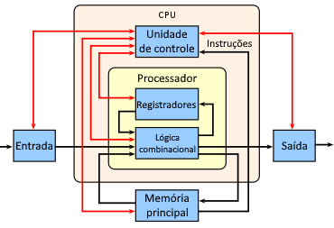
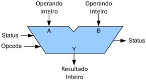
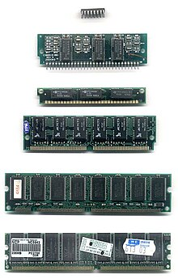

# [Trilha Python](index.md)

Leituras sugeridas:

- [História do computador pessoal](https://pt.wikipedia.org/wiki/Hist%C3%B3ria_do_computador_pessoal) - Wikipédia

Um padrão de computador pessoal pouco explorado no artigo acima é o `MSX`, que foi sucesso "apenas" no Japão, alguns países da Europa e aqui no Brasil. 

- [MSX](https://pt.wikipedia.org/wiki/MSX) - Wikipédia

## Arquitetura de computadores

fonte: https://pt.wikipedia.org/wiki/Unidade_central_de_processamento

A `Unidade de Controle` (UC) informa à memória do computador, à unidade aritmética e lógica e aos dispositivos de entrada e saída como responder às instruções que foram enviadas ao processador.

Os `Registradores` são uma memória temporária muito veloz usada pela própria CPU para realizar suas operações básicas.

A `Unidade Aritmética e Lógica` (Lógica combinatorial - UAL) realiza operações aritméticas inteiras e operações de lógica bit a bit (e, ou, não - and, or, not).

As `Entradas e Saídas - E/S` são diversas.

- teclado (entrada padrão)
- monitor (saída padrão)

Exemplos de `dispositivos de entrada` (Input)

- Microfone
- Scanner
- Webcam
- Touch
- Mouse

Exemplos de `dispositivos de saída` (Outuput) 

- Caixas de som
- Leds
- Impressora
- "Vibracall"

A `Memória RAM` é a `Memória Principal` de trabalho do computador. É de `armazenamento temporário` de dados e usada por programas para realizarem suas operações. É `volátil` (os dados "evaporam", são apagados, quando o computador é desligado).

> Diferentes tipos de RAM. A partir do alto: DIP, SIPP, SIMM 30 pin, SIMM 72 pin, DIMM (168-pin), DDR DIMM (184-pin) - Wikipédia [https://pt.wikipedia.org/wiki/Mem%C3%B3ria_de_acesso_aleat%C3%B3rio](https://pt.wikipedia.org/wiki/Mem%C3%B3ria_de_acesso_aleat%C3%B3rio)

O `armazenamento não-volátil` de dados é feito por memórias de armazenamento como:

- HD
- Cartão de memória
- SSD
- CD/DVD

Dados armazenados nessas memórias não são apagados quando o computador é desligado.

### [voltar](index.md)