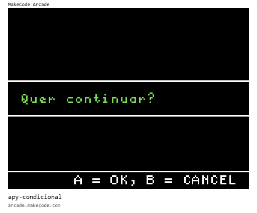

# [Trilha Python - SENAC Tech 2025](index.md)

## Lógica de programação

Os programas de exemplo abaixo rodam em um ambiente de desenvolvimento chamado [MakeCode Arcade](https://arcade.makecode.com).

> `Para rodar`
>
> 1. Abra o link [https://arcade.makecode.com](https://arcade.makecode.com)
> 1. Arraste a imagem para a janela do *MakeCode*

### Execução condicional - if, else

Dependendo do valor de uma variável, executamos um bloco de código ou outro.

### Validar senha

Usamos `entrada de dados` e `execução condicional` para programar uma operação mais complexa

### [voltar](index.md)