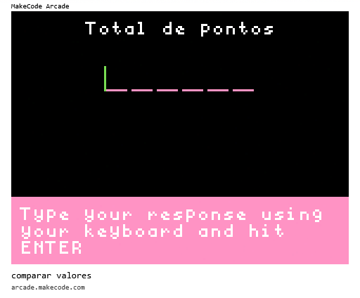
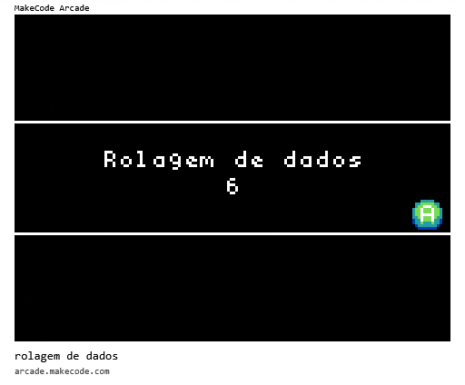

# [Trilha Python](index.md)

## Lógica de programação

Os programas de exemplo abaixo rodam em um ambiente de desenvolvimento chamado [MakeCode Arcade](https://arcade.makecode.com).

> `Para rodar`
>
> 1. Abra o link [https://arcade.makecode.com](https://arcade.makecode.com)
> 1. Arraste a imagem para a janela do *MakeCode*


### Execução condicional - if, else

Dependendo do valor de uma variável, executaremos um bloco de código ou outro.


Neste primeiro exemplo conheceremos os valores `booleanos`: Verdadeiro/Falso.


### Validar senha

Usaremos `entrada de dados` e `execução condicional` para programar uma operação mais complexa.

Neste exemplo vamos comparar `strings` usando o operados de igualdade `==`.


### Comparar valores numéricos

Vamos experimentar outros operadores de comparação:

- `==`  igual a
- `<`   menor do que
- `>`   maior do que
- `<=`  menor ou igual a
- `>=`  maior ou igual a




### Rolagem de dados - números aleatórios

Vamos usar a função `randint()` para gerar um número inteiro aleatório (random).

```python
# Rolando um dado de 6 lados
valor_do_dado = randint(1, 6)
game.splash("Rolagem de dados", valor_do_dado)

```



### [voltar](index.md)