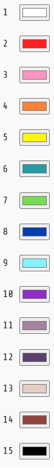
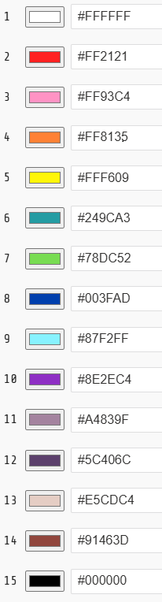

# [Trilha Python](index.md)

## Codificação de cores

Vamos estudar um dos possíveis modos de representar cores usando números.

Existem vários sistemas de codificação de cores. 

- RGB
- CMYK
- HSV
- e outros

Para criar e usar um sistema desses é preciso empregar o Pensamento Computacional que estamos estudando

- Decompor
- Reconhecer padrões
- Abstrair
- Pensar algoritmicamente

> `RGB` as cores são **decompostas** em 3 cores primárias.
>
> 
>
> Cada cor primária é novamente **decomposta** em **256 níveis de intensidade** 
> - 0 - escuro total - ausência da cor
> - 255 - máximo de intensidade da cor
>
> Compondo as 3 primárias, cada um com diferentes intensidades, é possível produzir **até 16,777,216 combinações cores** (256 x 256 x 256 = 16,777,216)
>
> Cada uma dessas combinação é codificada usando 3 valores numéricos. Exemplo
> - Preto (0, 0, 0)
> - Branco (255, 255, 255)
> - Vermelho (255, 0, 0)
> - Verde (0, 255, 0)
> - Azul (0, 0, 255)
> - Cinza (127, 127, 127)
> - Vermelho médio (127, 0, 0)
> 

### Código de exemplo

Os programas de exemplo abaixo rodam em um ambiente de desenvolvimento chamado [MakeCode Arcade](https://arcade.makecode.com).

> `Para rodar`
>
> 1. Abra o link [https://arcade.makecode.com](https://arcade.makecode.com)
> 1. Arraste a imagem para a janela do *MakeCode*

Esta é a tabela de codificação de cores que usamos no exemplo acima.

Note que estamos usando `números decimais` para codificar cada uma das cores.

É possível usar também números hexadecimais para codificá-las.

### [voltar](index.md)

