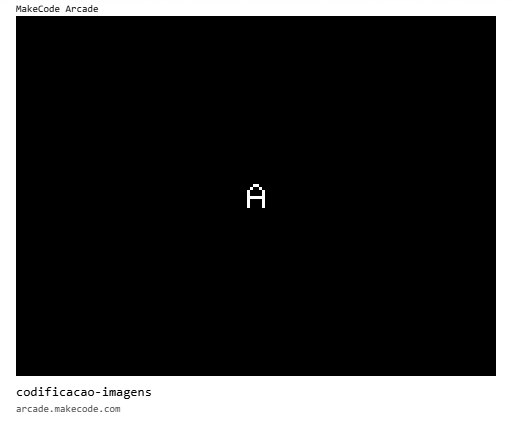

# [Trilha Python](index.md)

## Codificação de imagens

Vamos usar uma paleta de cores e uma matriz de valores numéricos para codificar uma imagem.

 > `paleta de cores` é uma tabela que mapeia uma cor a um valor numérico:
 >
 > ```
 > cor   ->  valor
 > ```

A matriz de valores vai representar cada um dos pixels que forma a imagem.

A letra `A` representada por uma matriz de 8x8.
```
00011000
00100100
01000010
01000010
01111110
01000010
01000010
01000010
```

- Cada valor da matriz codifica a cor de um pixel.
- A posição do valor na matriz codifica a posição do pixel na imagem

## Codigo de exemplo

Os programas de exemplo abaixo rodam em um ambiente de desenvolvimento chamado [MakeCode Arcade](https://arcade.makecode.com).

> `Para rodar`
>
> 1. Abra o link [https://arcade.makecode.com](https://arcade.makecode.com)
> 1. Arraste a imagem para a janela do *MakeCode*


- A letra A



- Uma cobrinha - (Python 😉)


### [voltar](index.md)