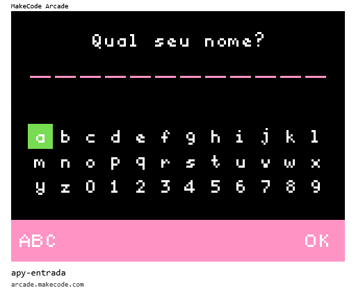

 # [Trilha Python](index.md)

## Entrada de dados

Os programas de exemplo abaixo rodam em um ambiente de desenvolvimento chamado [MakeCode Arcade](https://arcade.makecode.com).

> `Para rodar`
>
> 1. Abra o link [https://arcade.makecode.com](https://arcade.makecode.com)
> 1. Arraste a imagem para a janela do *MakeCode*

 
 ## Programa de exemplo

Este é um exemplo de entrada de dados pelo usuário via teclado.

### [voltar](index.md)