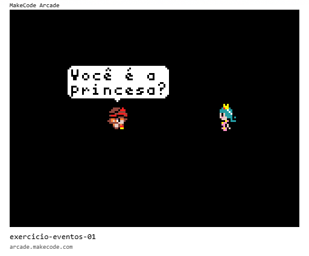
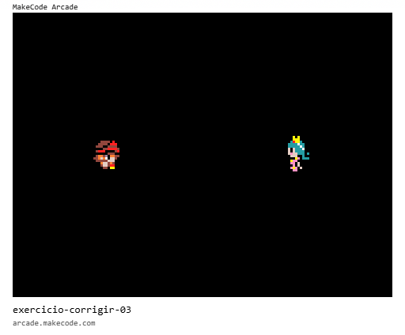
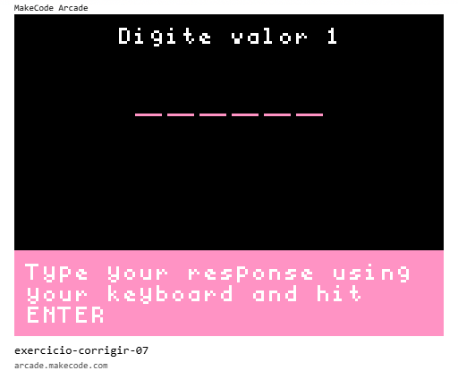
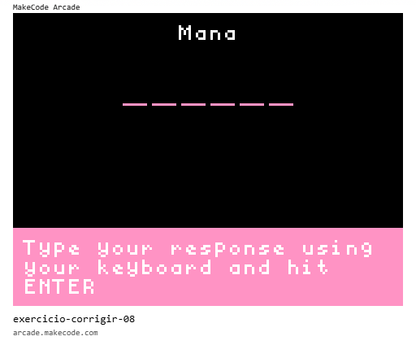
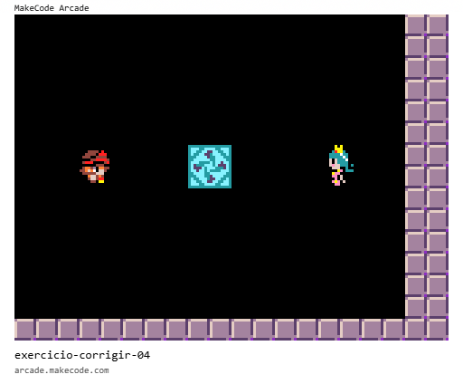
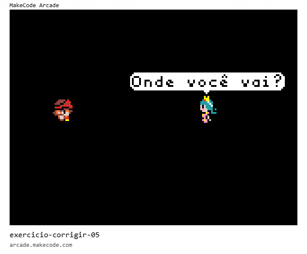
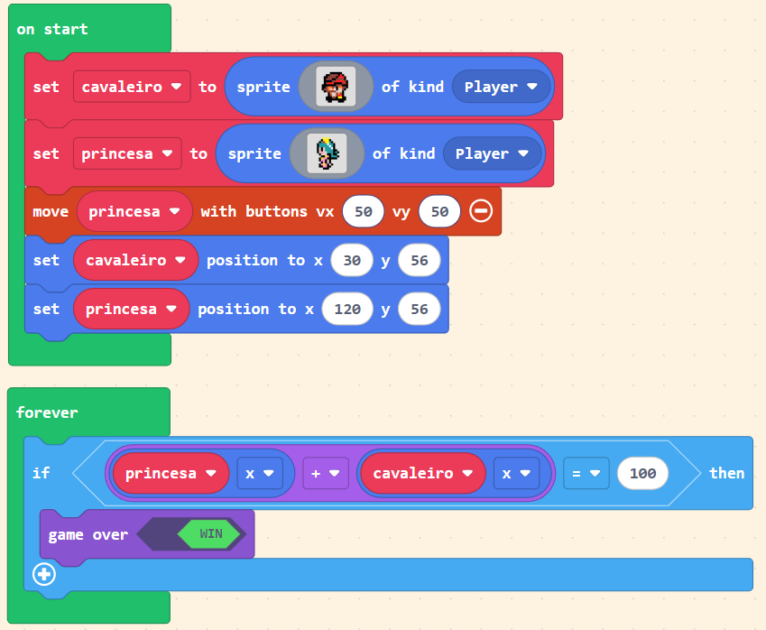

 [Trilha Python](index.md)

## Exercícios 


1. O código abaixo não está funcionando como deveria.
    
    O cavaleiro deveria dizer primeiro "Olá!" e depois "Você é a princesa?" porém só a segunda frase está aparecendo.

    Corrija o código para que as duas frases sejam exibidas corretamente na ordem esperada.

    

2. No programa abaixo a princesa não está falando quando apertamos o botão `A`. Ela não deve poder falar a qualquer momento também; apenas se o cavaleiro tiver passado da metade da tela. 

    Corrija o código para que, ao pressionar o botão `A` a princesa diga "Olá!" apenas se o cavaleiro tiver passado da metade da tela.

    

3. O programa abaixo está exibindo sempre duas mensagens
    - Valor 1 é maior
    - Valor 2 é maior

    Corrija o programa para que ele teste:
    
    ```
     se valor 1 é maior que valor 2:     
        escrever `Valor 1 é maior`

    senão:
        escrever `Valor 2 é maior`
    ```
    

4. Implemente no programa abaixo a seguinte condição:

```
Se ataque maior que mana:
    escrever "Bem vindo bárbaro!"
Senão se mana maior que defesa:
    escrever "Bem vindo mago!"
Senão se ataque menor que defesa:
    escrever "Bem vindo ladrão!"
```



5. No programa abaixo, há uma marca no chão que está na posição `x=72, y=56`. Corrija e complete o programa para que:
    - ao pressionar `B` o cavaleiro só fale com a princesa se ele tiver passado dessa marca.
    - ao pressionar `A` a princesa só fale com o cavaleiro se ele não tiver passado dessa marca.

    

6. O programa abaixo está errado. A princesa está sempre perguntando "Onde você vai?". Corrija o programa para que ela pergunte "Onde você vai?" apenas se o cavaleiro sair da tela pelo lado esquerdo.

    


7. Leia e interprete o programa abaixo e responda: qual deve ser PRECISAMENTE a posição `x` da princesa para que o jogo termine?

    


### [Voltar](index.md)

