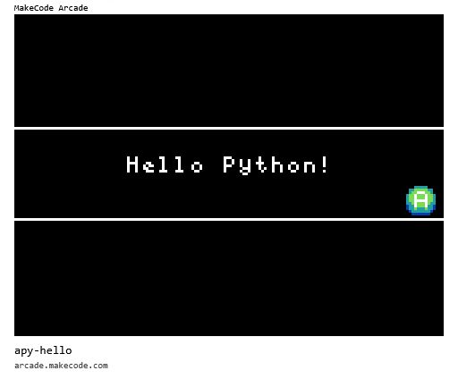
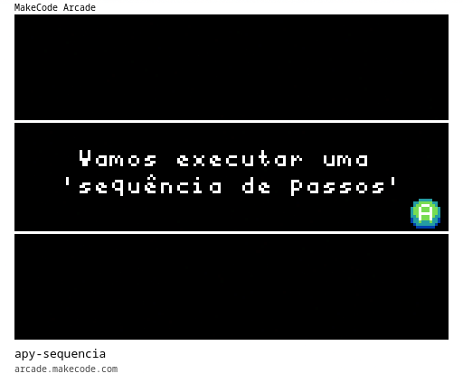

# [Trilha Python - SENAC Tech 2025](index.md)

## Lógica de programação

Os programas de exemplo abaixo rodam em um ambiente de desenvolvimento chamado [MakeCode Arcade](https://arcade.makecode.com).

> `Para rodar`
>
> 1. Abra o link [https://arcade.makecode.com](https://arcade.makecode.com)
> 1. Arraste a imagem para a janela do *MakeCode*

### Programas de exemplo

- Hello Python
Vamos testar se tudo está funcionando rodando este primeiro exemplo.

- Sequência de passos

Este é um algorítmo sequêncial. Cada linha do programa é uma instrução que damos ao computador e ele executa cada uma passo-a-passo na sequência em que foram escritas.

### [voltar](index.md)