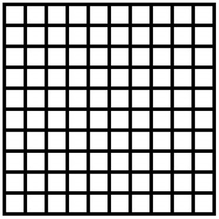
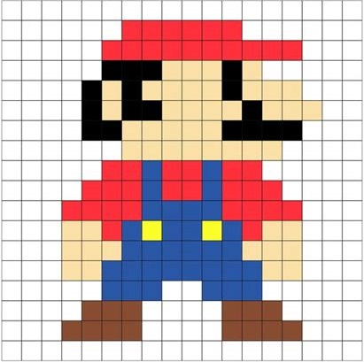
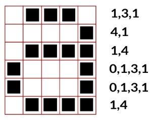

# [Trilha Python - SENAC Tech 2025](index.md)

## Imagens e algorítmos

O que vamos aprender

- De que são feitas as imagens digitais
- O que é um algorítmo

O que vamos fazer

- Criar uma imagem digital usando papel
- Escrever uma imagem digital em forma de código usando um algorítimo

## Imagens digitais

As telas dos computadores são divididas em uma grade de pequenos pontos chamados pixels.

pixel= **pic**ture
**el**ements (elemento de
imagem)

> `Imagens digitais` são fotos, desenhos ou qualquer tipo de coisa gráfica que vemos na tela do computador.

Nesta imagem os aliens foram ampliados para mostrar os pixels.

### Codificação de imagens

Os computadores armazenam desenhos, fotografias e outras imagens usando apenas números. Os números são usados para representar as cores de cada pixel que forma a imagem.

A figura nos mostra como uma `imagem` pode ser *representada* por um `código` formado por números.

A primeira linha consiste de:

- 1 pixel branco
- seguido de 3 pixels pretos
- e, por fim, de 1 pixel branco.
- 1,3,1 é o código que representa os pixels dessa linha

> `RLE`: Existem várias formas de representar uma imagem no computador. Esta é chamada **RLE**. (Run Length Encoding ou, Codificação por Trilha
Corrida)

## Algorítmo

Existe uma regra, uma receita, para formar as linhas de código RLE.

A receita é:

- Começamos de cima para baixo e da esquerda para a direita
- Vamos olhando a imagem pixel por pixel, contando quantos pixels
brancos vamos encontrando até que encontrar um pixel preto
- Escrevemos a quantidade de pixels brancos que encontramos
- Continuamos olhando a linha e contando os pixels pretos que vamos
encontrando até chegar em um pixel branco de novo
- Escrevemos a quantidade de pixels pretos que encontramos
- Repetimos esse processo, alternando entre sequências de pixels
brancos e pretos até chegar ao final da linha.
- Passamos para a próxima linha aplicando as mesmas regras até
chegar ao final da imagem
- Exceção: Se o primeiro pixel for preto, a linha deve começar com um
zero.

Essa sequência de passos (a receita) vai funcionar para **qualquer** imagem
em preto e branco

Quando criamos uma sequência de passos assim, chamamos ela de `Algorítmo`.

> `Algorítmo`: uma sequência de ações que:
> 
> 1. seguimos para completar uma tarefa
> 2. que podem ser repetidas para completar tarefas parecidas
> 3. e que tem um fim - em algum momento nós paramos e a tarefa está pronta

### [voltar](index.md)