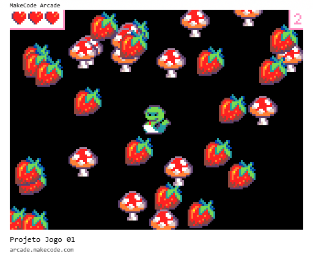
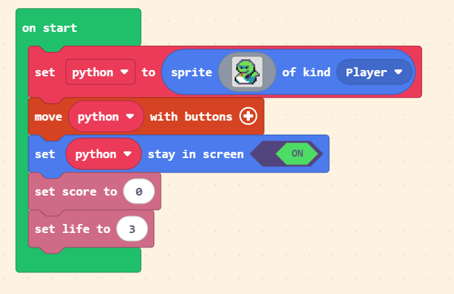
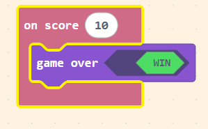
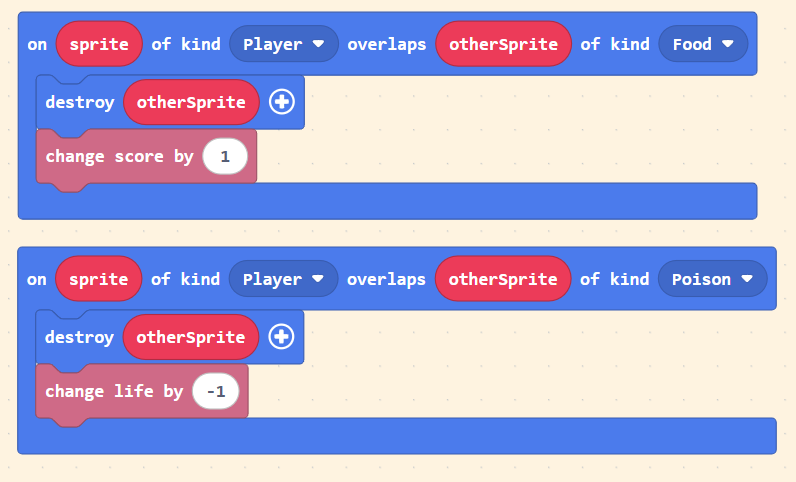
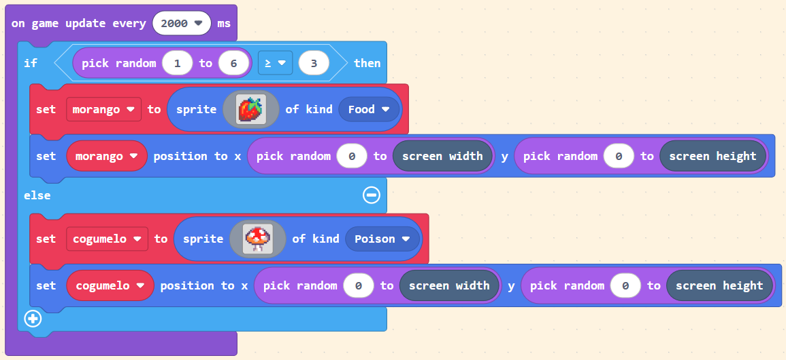

# [Trilha Python](index.md)

Neste projeto vamos fazer um jogo completo usando o que aprendemos sobre Eventos e como usá-los para disparar a execução de blocos de código. 



As regras do jogo são:

- A cobrinha (python) deve comer 10 morangos para vencer.
- Caso ela coma um cogumelo ela perde uma das três vidas.
- Se ela perder as três vidas ela perde o jogo.
- A cobrinha será movimentada pelas setas direcionais.
Os morangos e cogumelos aparecem em locais aleatórios da tela a cada 2 segundos.

## Inicialização do jogo

No bloco `on start` colocamos o código que será executado uma única vez, quando o programa iniciar.



Nesse código estamos:

1. Criando o sprite do jogador e guardando ele na variável `python`
1. Declarando que `python` deve ser movimentada pelas setas de direção.
1. Declarando que `python` não pode sair fora da tela.
1. Definindo que a variável `score` (que contém o valor da pontuação) inicialmente contém o valor `0`.
1. Definindo que o número de vidas é `3`.

Agora vamos usar um outro evento. `on score` é um evento que ocorre quando a variável `score` atinge um certo valor.



Nesse código definimos que

1. quando a variável `score` contiver o valor `10`...
1. ...o jogo encerra com o valor de `WIN` igual a `True`, ou seja, o jogador venceu a partida.


## Detecção de colisão

Vamos detectar a colisão do jogador com uma comida `Food` ou com um cogumelo venenoso `Poison`.

O evento `on sprite of kind... overlaps otherSprite of kind...`  significa:

```
Quando um sprite do tipo... sobrepuser outroSprite do tipo...
``` 



No código acima estamos usando dois desses eventos, um para o caso de o jogador colidir com uma comida e outro para caso ele colida com um veneno.

Nesses blocos, a variável `sprite` contém o sprite do jogador, que é o único do tipo `Player` em nosso jogo. A variável `otherSprite` contém o sprite com o qual `sprite` colidiu, podendo ser qualquer outro sprite que esteja na tela. 

A instrução `destroy otherSprite` remove da tela o sprite com o qual o jogador colidiu. 

## Loop de criação de sprites

O código abaixo é executado `a cada 2 segundos` para criar ou um sprite de comida ou um de veneno.



O bloco `if` testa se o valor de `um dado de 6 lados` é `maior ou igual a 3`. Caso seja, cria um `morango`, senão, cria um `cogumelo`.

O novo sprite criado é colocado em uma posição aleatória na tela.

Observe que:
- usamos `2x` a função `pick random`, uma para determinar o valor de `x` e outra para a posição `y`. 
- os valores possíveis de `x` vão de `0` até `screen width`, que é uma variável que contém o valor da `largura` da tela.
- os valores possíveis de `y` vão de `0` até `screen heigth`, que é uma variável que contém o valor da `altura` da tela.

Desse modo os valores sorteados pela função `pick random` não ultrapassam nunca os valores mínimos e máximos da tela, fazendo os sprites criados aparecerem sempre dentro da tela.

```
se dado >= 3
    cria morango
     x = um número entre 0 e largura da tela
     y = um número entre 0 e altura da tela
     muda posição do morango para x,y
senão
    cria cogumelo
    cria morango
    x = um número entre 0 e largura da tela
    y = um número entre 0 e altura da tela
    muda posição do cogumelo para x,y
```

## Desafio

Usando as funções que já aprendemos e as novas funções e técnicas demonstradas neste projeto, crie um novo jogo. Não se preocupe se ele ficar parecido com este. O importante é fazer alguma modificação e que ela contenha alguma ideia sua.

### [Voltar](index.md)