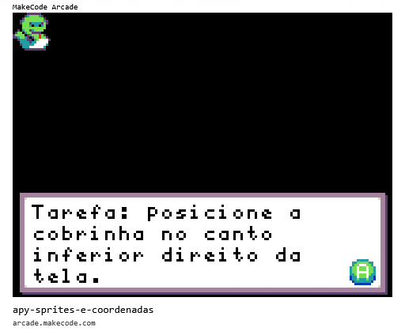

# [Trilha Python - SENAC Tech 2025](index.md)

## Lógica de programação

Os programas de exemplo abaixo rodam em um ambiente de desenvolvimento chamado [MakeCode Arcade](https://arcade.makecode.com).

> `Para rodar`
>
> 1. Abra o link [https://arcade.makecode.com](https://arcade.makecode.com)
> 1. Arraste a imagem para a janela do *MakeCode*

### Desafio: Sprites e coordenadas

Um 'Sprite' é uma imagem que pode ser movida pela tela.

A imagem da cobrinha tem 16x16 pixels.
Sua posição no início do progama é:

- x: 8
- y: 8

