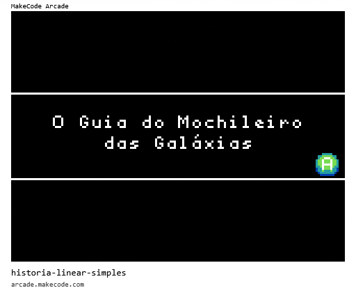
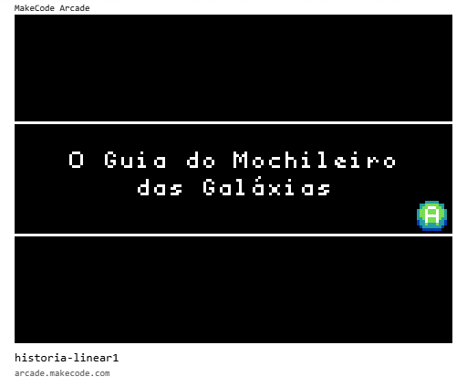
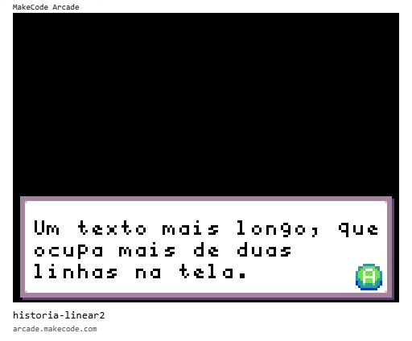
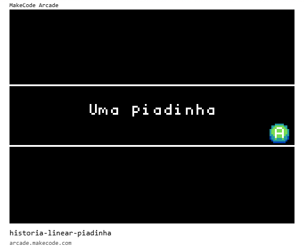
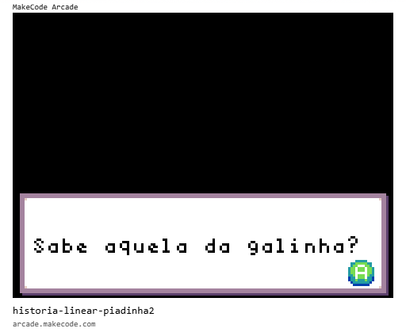
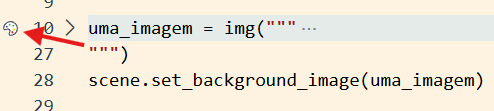
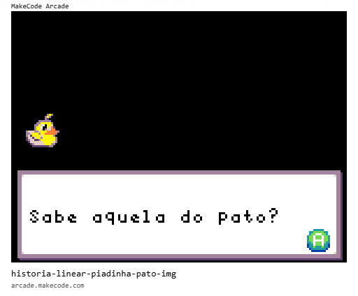

# [Trilha Python](index.md)

# Contar uma história


> Você precisará de duas habilidades para ser programador:
> 
> - Primeiro, você terá que aprender a linguagem de programação (Python), ou seja, você terá que conhecer o vocabulário e a gramática. Você deverá ser capaz de escrever as palavras corretamente nessa nova linguagem de forma a construir "sentenças” bem formadas.
> 
> - Segundo, você precisa “contar uma história". Quando contamos uma história combinamos palavras e sentenças para transmitir uma ideia ao leitor. A construção de uma história requer arte e habilidade. Elas são aperfeiçoadas quando você escreve e alguém avalia o seu trabalho dando um feedback sobre ele. Na área de programação, o nosso programa é a “história” e o problema que nós estamos querendo solucionar é a “ideia”.
> 
>   [Python para todos](https://do1.dr-chuck.com/pythonlearn/PT_br/pythonlearn.pdf), Charles  Severance


Vamos usar tudo o que aprendemos até agora sobre programação para escrever uma história. Depois vamos mostrá-la a um colega para receber feedback sobre ela.


## Projeto

Já aprendemos como mostrar texto e imagens na tela.

Podemos escrever um programa que "conta uma história" mostrando linhas de texto, fazendo com que cada parágrafo ou linha de diálogo seja apresentada na tela uma após a outra na sequência da história.

Depois, podemos fazer com que imagens aparecem ao mesmo tempo que o texto, ilustrando a narrativa.

O resultado deve ficar parecido com uma apresentação de slides ou com uma narração de um jogo tipo Adventure...

## História de exemplo



## Primeiras Ferramentas - texto

Já conhecemos algumas ferramentas que nos ajudarão a construir esse programa.

### game.splash()

#### Sintaxe:

`game.splash(string, string)`

Função usada para mostrar uma mensagem na tela com até duas linhas (por isso são 2 strings como parâmetro)

#### Exemplo:

```python
game.splash("O Guia do Mochileiro", "das Galáxias")
```

#### Resultado:




### game.show_long_text

#### Sintaxe: `game.show_long_text(string, numero_posicao)`

Função usada para mostrar (*show*) um texto longo (*long text*). 

`DialogLayout.BOTTOM` é uma variável que contém um número que representa a posição na tela onde o texto longo será exibido. 

As possibilidades são:

- *DialogLayout*.**BOTTOM** - parte de baixo
- *DialogLayout*.**CENTER** - centro da tela
- *DialogLayout*.**FULL** - tela inteira
- *DialogLayout*.**LEFT** - lado esquerdo
- *DialogLayout*.**RIGHT** - lado direito
- *DialogLayout*.**TOP** - parte de cima

#### Exemplo:

```python
game.show_long_text("Um texto mais longo, que ocupa mais de duas linhas na tela.", DialogLayout.BOTTOM)
```

#### Resultado:




## Primeira versão do programa

Com apenas essas duas funções já podemos construir um programa que conta uma história. Por exemplo:

```python
# Uma piadinha
game.splash("Uma piadinha")
game.show_long_text("Sabe aquela do pinto?", DialogLayout.BOTTOM)
game.show_long_text("...", DialogLayout.BOTTOM)
game.show_long_text("Piu!", DialogLayout.BOTTOM)
game.show_long_text(":(", DialogLayout.CENTER)
game.splash("Obrigado!", "Tchau")
```



## Abstração para melhorar o programa

Vamos usar o que aprendemos sobre `variáveis` para melhorar o programa.

O que vamos fazer é deixar o código mais `genérico` para que ele fique mais `reutilizável` e mais `fácil de modificar`.

```python
# Gerador de piadas
titulo = "Uma piadinha"
sujeito = "o pinto"
som = "Piu!"

game.splash(titulo)
game.show_long_text("Sabe aquela d"+sujeito+"?", DialogLayout.BOTTOM)
game.show_long_text("...", DialogLayout.BOTTOM)
game.show_long_text(som, DialogLayout.BOTTOM)
game.show_long_text(":(", DialogLayout.CENTER)
game.splash("Obrigado!", "Tchau")
```

Para quem usa o programa, nada mudou. O que aparece na tela é o mesmo que no programa anterior.

A diferença agora é que com o programa escrito assim fica mais fácil modificá-lo para que ele "conte" outras piadas. 

Não precisamos procurar e alterar as strings com o texto no meio do programa. **Todos os dados importantes estão no topo do código em variáveis** fáceis de modificar.

> **Ideia importante**: Modificando o valor das variáveis modificamos o comportamento do programa.

#### Exemplo:

```python
# Gerador de piadas
titulo = "Uma piadinha"
sujeito = "a galinha"
som = "Có!"

game.splash(titulo)
game.show_long_text("Sabe aquela d"+sujeito+"?", DialogLayout.BOTTOM)
game.show_long_text("...", DialogLayout.BOTTOM)
game.show_long_text(som, DialogLayout.BOTTOM)
game.show_long_text(":(", DialogLayout.CENTER)
game.splash("Obrigado!", "Tchau")
```

#### Resultado:




## Mais ferramentas - imagens

Agora vamos recuperar o que aprendemos sobre codificação de imagens e juntar com o que fizemos usando texto para criar uma história ilustrada.

Vamos trabalhar com duas formas de colocar uma imagem na tela:

- mudando o plano de fundo
- criando um sprite

## Mudar o plano de fundo (background)

Podemos mudar a cor do plano de fundo e também colocar uma imagem em seu lugar.

### Cor do plano de fundo

Nós mudamos a cor do plano de fundo usando a
função `set_background_color()`

Sintaxe: `scene.set_background_color(numero_da_cor)`

Exemplo: 

```python
# Muda a cor do fundo para Amarelo
scene.set_background_color(5)
```

### Imagem no plano de fundo

Para colocar uma imagem no plano de fundo usamos a função `set_background_image()

#### Sintaxe: `scene.set_background_image(imagem)`

A `imagem` passada como parâmetro para a função é criada a partir da `string` da matriz de valores hexadecimais que codifica a imagem e que é convertida em imagempela função `img()`.

#### Exemplo: 

```python
uma_imagem = img("""
    . . . . . . . . . . b 5 b . . .
    . . . . . . . . . b 5 b . . . .
    . . . . . . . . . b c . . . . .
    . . . . . . b b b b b b . . . .
    . . . . . b b 5 5 5 5 5 b . . .
    . . . . b b 5 d 1 f 5 5 d f . .
    . . . . b 5 5 1 f f 5 d 4 c . .
    . . . . b 5 5 d f b d d 4 4 . .
    b d d d b b d 5 5 5 4 4 4 4 4 b
    b b d 5 5 5 b 5 5 4 4 4 4 4 b .
    b d c 5 5 5 5 d 5 5 5 5 5 b . .
    c d d c d 5 5 b 5 5 5 5 5 5 b .
    c b d d c c b 5 5 5 5 5 5 5 b .
    . c d d d d d d 5 5 5 5 5 d b .
    . . c b d d d d d 5 5 5 b b . .
    . . . c c c c c c c c b b . . .
""")

scene.set_background_image(uma_imagem)
```

> Vamos usar o editor de imagens do MakeCode para isso. Se você quiser, pode editar valor por valor da matriz, mas lembre-se que a aula tem só 3h!
>
> Quando você está editando código pode acessar o editor de imagens clicando no ícone indicado pela seta.
>
> 


Agora podemos criar uma imagem de fundo para cada personagem da história e alternar a imagem de fundo conforme qual personagem está falando.

#### Exemplo:




# [Voltar](index.md)

