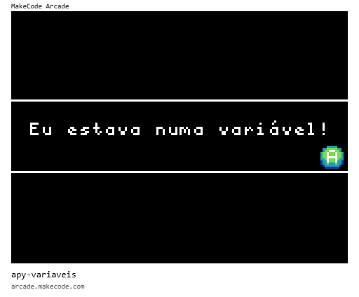

# [Trilha Python](index.md)

## Variáveis

Os programas de exemplo abaixo rodam em um ambiente de desenvolvimento chamado [MakeCode Arcade](https://arcade.makecode.com).

> `Para rodar`
>
> 1. Abra o link [https://arcade.makecode.com](https://arcade.makecode.com)
> 1. Arraste a imagem para a janela do *MakeCode*

### Programa de exemplo

Variáveis são usadas para armazenar valores na memória do computador para que o programa possa usá-los posteriormente.

Os valores das variáveis podem vir de 3 lugares:
- quando escritos no próprio programa
- como resultado de uma operação do programa que gera um novo valor
- do usuário do programa que entra o valor pelo teclado, mouse, touch...

    
### [voltar](index.md)